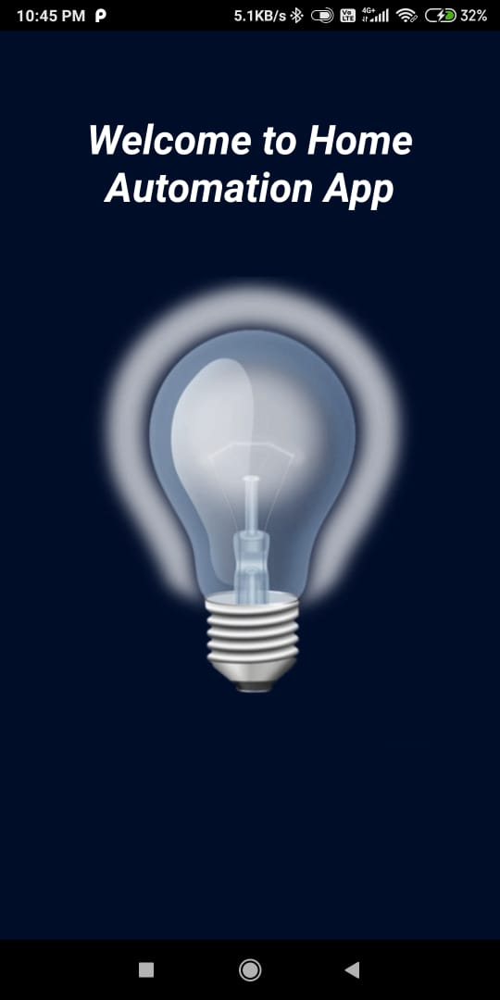
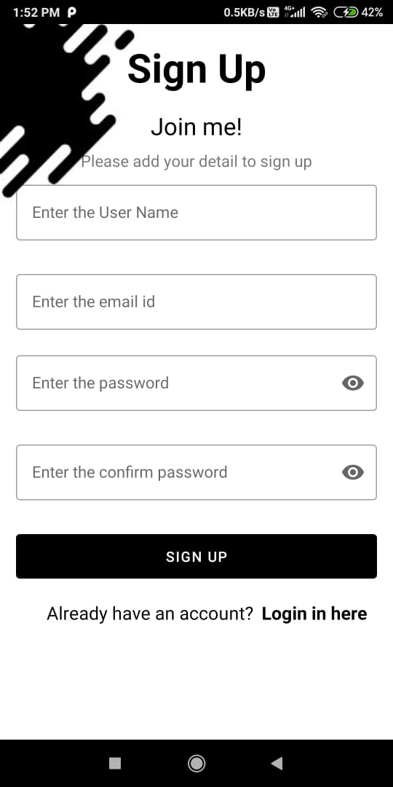
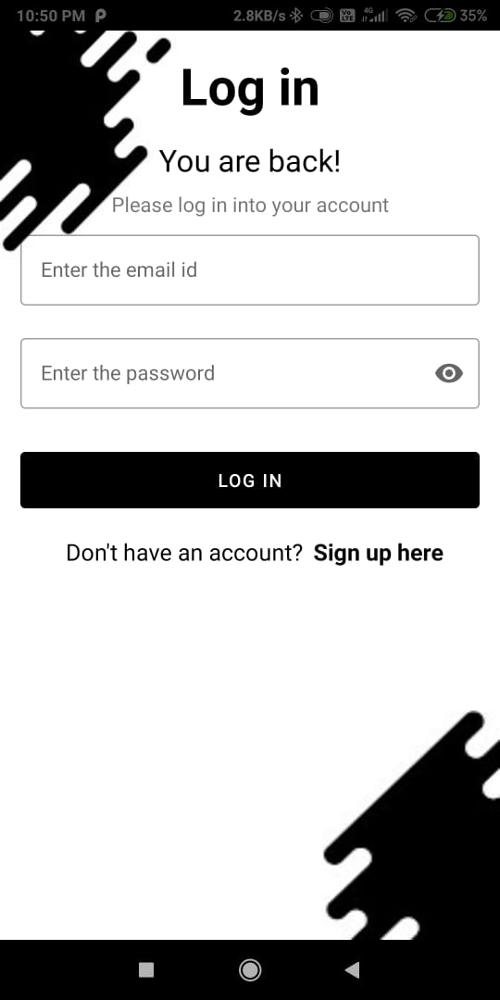
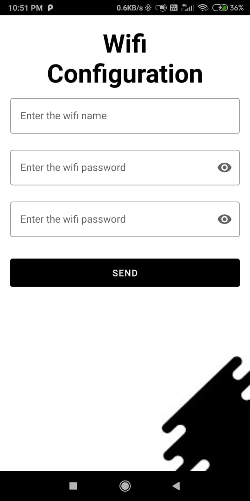
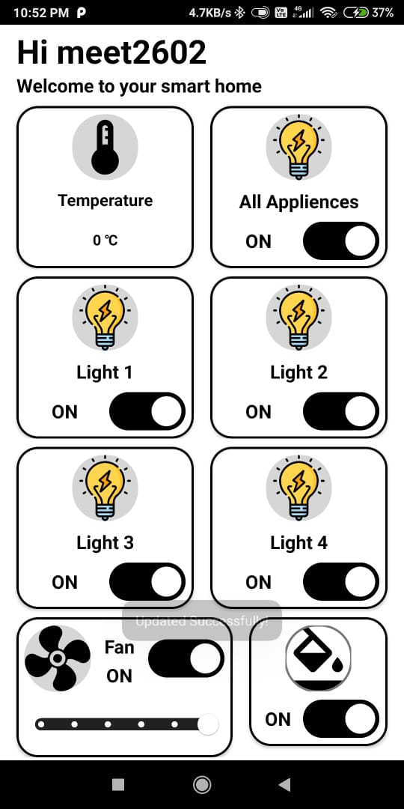
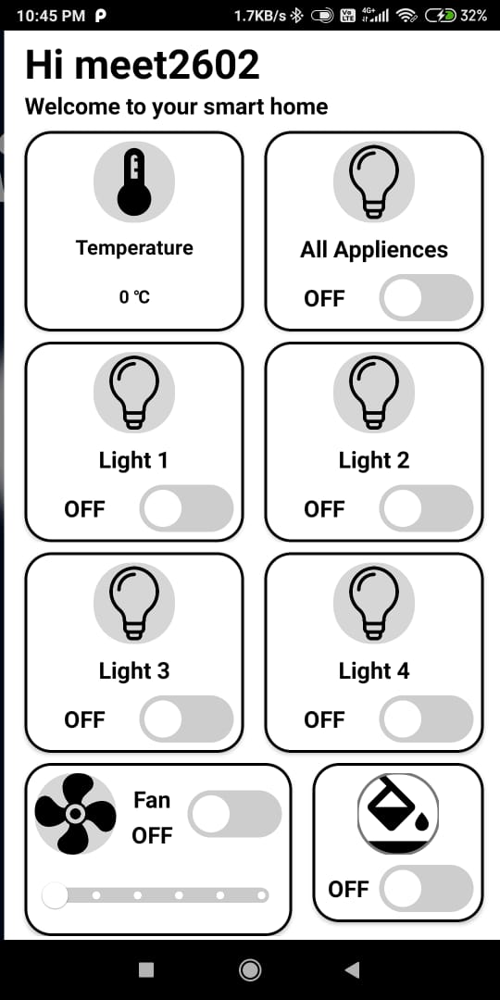

# HomeAutomationApp
Home automation system controls the home appliances or appliances at any other place remotely  which is helpful to the system’s users as it gives them an ease of access to their electronic devices. This remote access can be controlled through an android application which has a friendly user  interface.
# Screenshot

